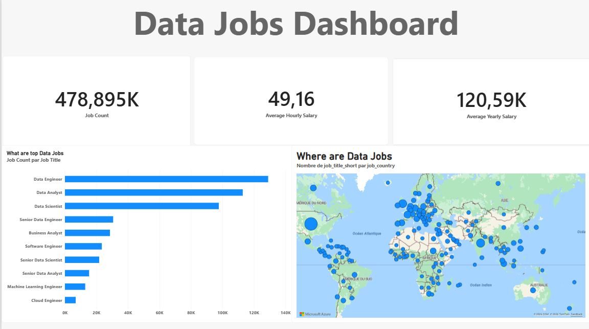

# Data Jobs Dashboard - Power BI

Projet d'analyse de données réalisé avec Power BI sur les offres d'emploi dans le domaine de la Data.

## 📊 Aperçu du Dashboard

## 📁 Contenu du dépôt
- `jobs.pbix` : Le fichier de travail Power BI avec le modèle de données, les visuels et les mesures.
- `reduire.py` : Script Python utilisé pour prétraiter et échantillonner le volumineux jeu de données source.
- `echantillon.csv` : Échantillon représentatif des données (extrait via le script Python pour respecter les limites de taille de GitHub).
